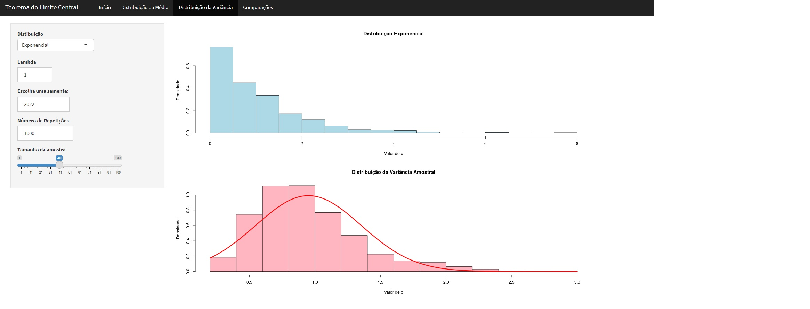
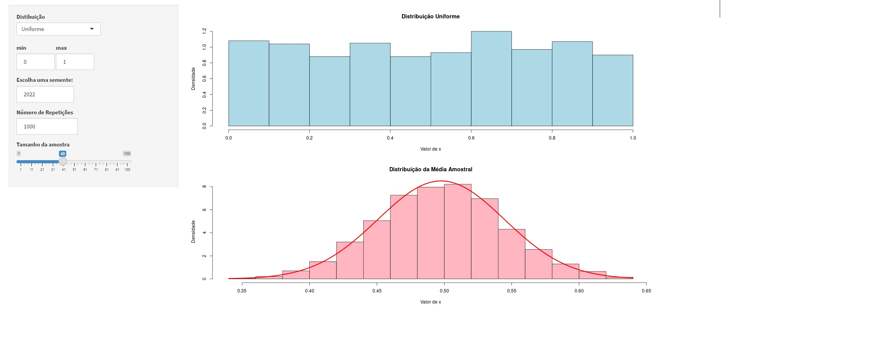

# (PT-BR) Teorema do Limite Central por simulação de Monte Carlo

O teorema central do limite é um dos resultados mais importantes e úteis da estatística e da probabilidade. Ele afirma que, independentemente da distribuição de probabilidade subjacente, a média de um grande número de amostras aleatórias tende a se aproximar de uma distribuição normal. Isso é particularmente útil na modelagem de fenômenos naturais e sociais, pois muitos processos complexos podem ser aproximados por uma distribuição normal.

No entanto, o teorema central do limite nem sempre é fácil de aplicar em prática, especialmente quando não conhecemos a distribuição subjacente. É aqui que as simulações de Monte Carlo podem ser úteis. As simulações de Monte Carlo são uma técnica computacional que envolve a geração de números aleatórios para simular eventos incertos. Essas simulações podem ser usadas para obter aproximações para a distribuição de probabilidade de um processo, permitindo-nos aplicar o teorema central do limite e extrair informações úteis sobre o fenômeno em questão.

Assim, o teorema central do limite e as simulações de Monte Carlo trabalham juntos para permitir a modelagem e a análise de processos complexos que podem ser difíceis de entender e prever de outra forma. Eles são fundamentais para a análise estatística moderna e têm aplicações em uma ampla gama de áreas, desde finanças até ciência de materiais.

## Interface para visualização dos conceitos apresentados
[Clique para visualização da aplicação Shiny do TCL por Monte Carlo](https://matheussalvess.shinyapps.io/deploy_tcl/)

[Post no Medium](https://medium.com/@matheuss_alvess/o-uso-de-simula%C3%A7%C3%A3o-de-monte-carlo-para-o-teorema-central-do-limite-885a93841ab5)

  

  

